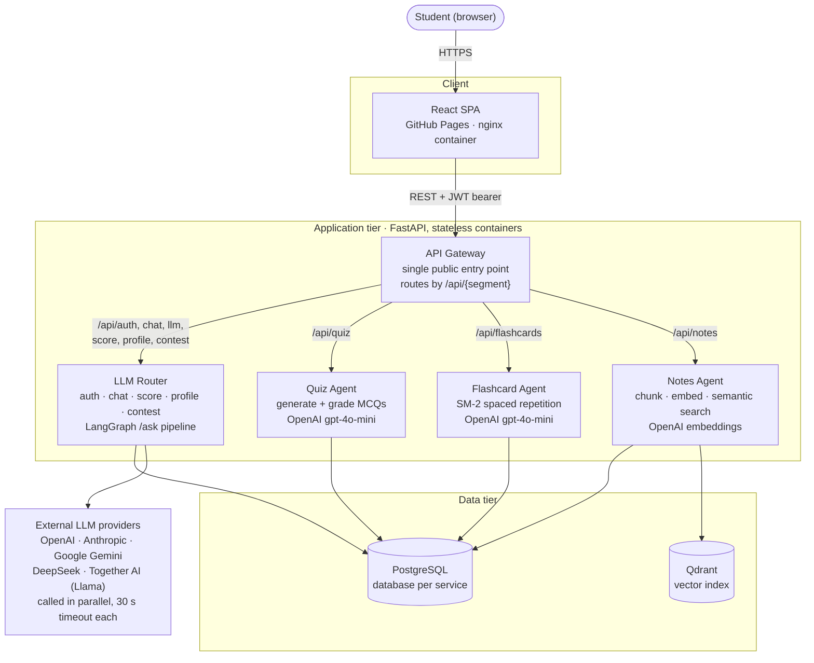
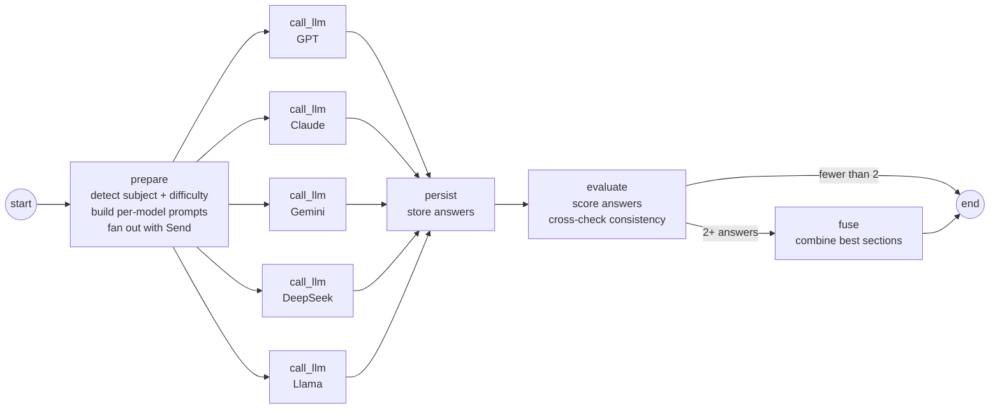
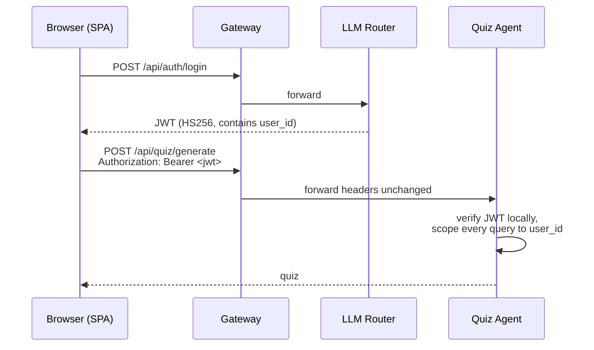

# StudyMate

**Study from your own notes. Duel your friends. Stay focused.**

StudyMate is an AI study platform that turns your class notes into quizzes and flashcards, so you review what your professor actually taught instead of generic material. Challenge a study partner to a duel, run focused Pomodoro sessions, and let StudyMate learn which AI model explains each subject best for you.

**[Live Demo](https://delight-bot.github.io/Study-Mate/)**

---

## Features

### Upload Your Notes
Upload your class notes and StudyMate indexes them for semantic search. Everything it generates, from quizzes to flashcards to duel questions, comes from *your* material.

### Quizzes
Generate multiple-choice quizzes from your notes and get your answers graded instantly.

### Flashcards with Spaced Repetition
Generate flashcards from your notes. Reviews are scheduled with the SM-2 spaced-repetition algorithm, so cards you struggle with come back sooner and cards you know well come back later.

### Study Duels
Challenge a study partner head to head. You can play a duel two ways:
- **From notes:** upload notes and StudyMate generates the questions for both of you.
- **Bring your own:** add your own questions and use StudyMate as the dueling platform.

### Pomodoro Timer
A built-in Pomodoro timer keeps sessions focused, with timed work blocks and breaks.

### Ask Any Question, Get the Best Answer
Ask a question and StudyMate sends it to 5 LLMs in parallel, then shows the responses side by side. Pick the one that helped most, and StudyMate learns your preference for that subject.

---

## How the AI Works

### LLM Router with Subject Profiling
StudyMate learns which model works best for you in each subject, such as Chemistry, Calculus, or Programming.

1. **Classify:** each question is automatically tagged with a subject and difficulty level.
2. **Compare:** the question goes to all 5 LLMs, each with a prompt adapted to your profile, the subject, and the difficulty.
3. **Choose:** you pick the most helpful response, and that choice updates your subject profile.
4. **Route:** as confidence grows, StudyMate recommends your best model for that subject.

| Profile strength | Questions answered | Confidence |
|---|---|---|
| Weak | Fewer than 3 | Low |
| Moderate | 3 to 10 | Building |
| Strong | More than 10 | High |

Once a subject has 10+ questions and confidence above 85%, StudyMate auto-suggests the best model.

### Automatic Response Scoring
Every response is scored on four weighted metrics:

| Metric | Weight | What it measures |
|---|---|---|
| Depth | 0.30 | Technical detail and thoroughness |
| Clarity | 0.25 | Sentence structure and readability |
| Correctness | 0.25 | Fact-checking and verification |
| Formatting | 0.20 | Structure, code blocks, and lists |

### Hallucination Checker
StudyMate cross-checks answers across all 5 models, flags numerical discrepancies and contradicting statements, and produces a consensus score.

### Response Fusion
StudyMate can combine the strongest parts of several responses, for example one model's explanation with another's code and a third's examples, and attributes each section to its source model.

### Supported Models
| Provider | Default model |
|---|---|
| OpenAI | `gpt-4o-mini` |
| Anthropic | `claude-3-5-sonnet-20241022` |
| Google | `gemini-3.6-flash` |
| DeepSeek | `deepseek-chat` |
| Together AI (Llama) | `meta-llama/Llama-2-70b-chat-hf` |

Models are configured in `backend/services/`.

---

## Architecture

StudyMate runs as a set of independently deployable FastAPI services behind a
single gateway. The same containers run locally (Docker Compose), on Kubernetes,
and in the live demo (Render + GitHub Pages).

### System overview



| Service | Path prefix | Responsibility | State |
|---|---|---|---|
| **Gateway** (`gateway/`) | `/api/*` | Reverse proxy, CORS, routes on the first path segment | none |
| **LLM Router** (`backend/`) | `/api/auth`, `chat`, `llm`, `score`, `profile`, `contest` | Accounts and JWT issuing; multi-LLM Q&A pipeline; scoring and per-subject profiles; study duels | Postgres |
| **Quiz Agent** (`services/quiz-agent/`) | `/api/quiz` | Generates multiple-choice quizzes from notes and grades submissions | Postgres |
| **Flashcard Agent** (`services/flashcard-agent/`) | `/api/flashcards` | Generates cards and schedules reviews with SM-2 | Postgres |
| **Notes Agent** (`services/notes-agent/`) | `/api/notes` | Stores notes, embeds chunks, semantic search | Postgres + Qdrant |

### Multi-LLM answer pipeline (LangGraph)

`POST /api/chat/ask` is a LangGraph `StateGraph` (`backend/graph/ask_graph.py`).
Each step is a node, and the per-model calls fan out in parallel with `Send`.



A slow or failing provider becomes an error entry for that model. It never
fails the whole request, so the student still gets every answer that came back.

### Authentication flow



### Deployment targets

| | Local · Docker Compose | Kubernetes (`k8s/`) | Hosted demo · Render + GitHub Pages |
|---|---|---|---|
| **Frontend** | nginx container | Deployment + Service | GitHub Pages, built by GitHub Actions |
| **Services** | One container each | Deployments with readiness/liveness probes; HPA scales Quiz Agent 1 → 5 | Render Docker web services, defined in the `render.yaml` Blueprint |
| **PostgreSQL** | `postgres:16`, 4 databases, named volume | StatefulSet + PersistentVolumeClaim | Render managed Postgres (one shared database on the free tier) |
| **Qdrant** | Container + volume | StatefulSet + volume | Render image service |
| **Service discovery** | Compose DNS | Kubernetes Service DNS | Public service URLs |
| **Secrets** | `backend/.env` | `Secret` (gitignored) | Render env group (`JWT_SECRET`) + per-service keys |

### Design decisions and trade-offs

- **One public entry point.** The frontend only knows the gateway's URL, so
  services can move, split or scale without client changes. Routing is a
  lookup on the first path segment, so adding a service is a one-line change.
- **Every service verifies the token itself.** Services don't trust the
  gateway. Each one checks the JWT and filters every query by the `user_id`
  inside it, so one user's data can't leak to another even if the gateway
  were bypassed.
- **Database per service.** Each service owns its schema, with no
  cross-service joins, so services deploy and migrate independently. On
  Render's free tier these share one physical database, a cost trade-off
  the code doesn't depend on.
- **Partial failure over total failure.** Every provider call has its own
  timeout and error handling, so one slow or broken provider never blocks the
  answers from the others.
- **Stateless compute, scale where the load is.** All state lives in
  Postgres/Qdrant, so any service can run more replicas. LLM-heavy quiz
  generation scales on its own through a HorizontalPodAutoscaler.
- **The pipeline is an explicit graph.** Modelling `/ask` in LangGraph makes
  each step, the parallel fan-out and the conditional fusion visible and
  testable. New steps, such as profile-based model routing, plug in as nodes.

**Known limitations / next steps:** free-tier services sleep, so the first
request is slow; services talk over public URLs because the free tier lacks
private networking; the shared HS256 secret would move to asymmetric keys
(RS256 + JWKS) so only the router can sign tokens; the gateway would add rate
limiting and per-request tracing (OpenTelemetry).

### Project Structure

```text
StudyMate/
├── backend/            # LLM Router Agent (FastAPI)
│   ├── routers/        # API endpoints
│   ├── services/       # LLM integrations
│   ├── models/         # Data models
│   ├── memory/         # Subject profiling
│   ├── evaluation/     # Scoring and hallucination detection
│   ├── graph/          # LangGraph pipeline behind /api/chat/ask
│   ├── utils/          # Helpers
│   └── app.py          # Entry point
├── gateway/            # FastAPI gateway
├── services/
│   ├── quiz-agent/
│   ├── flashcard-agent/
│   └── notes-agent/
├── frontend/           # React app
│   ├── components/
│   ├── pages/          # Chat and dashboard
│   └── main.jsx
├── database/
│   └── schema.sql
└── k8s/                # Kubernetes manifests
```

---

## Getting Started

### Prerequisites
- Python 3.9+
- Node.js 18+
- Docker (for Compose or Kubernetes)
- API keys for OpenAI, Anthropic, and Google Gemini (DeepSeek and Together AI are optional)

### Option 1: Docker Compose

```bash
docker compose build
docker compose up -d
```

| Service | URL |
|---|---|
| Frontend | http://localhost:3001 |
| Gateway | http://localhost:8080 |
| Qdrant | http://localhost:6333 |

Stop everything with `docker compose down`.

### Option 2: Kubernetes

Requires a local cluster, for example Docker Desktop with Kubernetes enabled (Settings > Kubernetes > Enable Kubernetes).

```bash
# Build images so the cluster can see them
docker build -t studeymate/llm-router:local -f backend/Dockerfile .
docker build -t studeymate/gateway:local ./gateway
docker build -t studeymate/quiz-agent:local ./services/quiz-agent
docker build -t studeymate/flashcard-agent:local ./services/flashcard-agent
docker build -t studeymate/notes-agent:local ./services/notes-agent
docker build -t studeymate/frontend:local ./frontend

# Create your secret from the template (never commit the result)
cp k8s/secret.example.yaml k8s/secret.yaml
# Add your API keys to k8s/secret.yaml

kubectl apply -f k8s/namespace.yaml
kubectl apply -f k8s/
kubectl get pods -n studeymate -w
```

Scale just the Quiz Agent:

```bash
kubectl scale deployment/quiz-agent --replicas=5 -n studeymate
```

### Option 3: Local Development

**Backend**
```bash
cd backend
pip install -r requirements.txt
cp .env.example .env    # add your API keys
python app.py           # http://localhost:8000
```

**Frontend**
```bash
cd frontend
npm install
npm run dev             # http://localhost:3000
```

---

## API Reference

Every endpoint except register and login requires an `Authorization: Bearer <jwt>`
header. The user always comes from the token, never from the URL.

### Auth
| Method | Endpoint | Description |
|---|---|---|
| POST | `/api/auth/register` | Create an account |
| POST | `/api/auth/login` | Get a JWT |
| GET | `/api/auth/me` | Get the current user |

### Chat
| Method | Endpoint | Description |
|---|---|---|
| POST | `/api/chat/ask` | Ask all LLMs, then score, cross-check and fuse the answers |
| GET | `/api/chat/history` | Get your chat history (optional `?subject=`) |
| GET | `/api/chat/subjects` | List subjects |

### Scoring
| Method | Endpoint | Description |
|---|---|---|
| POST | `/api/score/choose` | Record the user's chosen response |
| POST | `/api/score/feedback` | Submit detailed feedback |
| GET | `/api/score/stats/me` | Get your statistics |

### Profiles
| Method | Endpoint | Description |
|---|---|---|
| GET | `/api/profile/me` | Get your full profile |
| GET | `/api/profile/me/subject/{subject}` | Get a subject-specific profile |
| GET | `/api/profile/me/recommendations` | Get model recommendations |

### LLMs
| Method | Endpoint | Description |
|---|---|---|
| POST | `/api/llm/query/{llm_name}` | Query a single model |
| GET | `/api/llm/available` | List available models |
| GET | `/api/llm/models` | Get model details |

### Study Duels
| Method | Endpoint | Description |
|---|---|---|
| POST | `/api/contest/create` | Start a duel and get a join code |
| POST | `/api/contest/{code}/join` | Join a duel |
| POST | `/api/contest/{code}/progress` | Report study progress |
| POST | `/api/contest/{code}/quiz-result` | Submit a quiz score |
| GET | `/api/contest/{code}` | Get the duel state |

The quiz, flashcard and notes agents serve their own routes under `/api/quiz`,
`/api/flashcards` and `/api/notes` (see each service's `main.py`).

---

## Database

| Table | Purpose |
|---|---|
| `users` | User accounts |
| `subjects` | Subject areas |
| `llm_responses` | All model responses |
| `user_choices` | Responses users picked as best |
| `profiles` | Per-subject performance profiles |
| `difficulty_scores` | Question difficulty analysis |
| `hallucination_logs` | Detected inconsistencies |
| `evaluation_scores` | Automatic quality scores |

---

## Tech Stack

**Frontend:** React, nginx
**Backend:** FastAPI, Python
**AI:** LangGraph, OpenAI, Anthropic, Google Gemini, DeepSeek, Llama (Together AI), RAG
**Data:** PostgreSQL, Qdrant
**Infrastructure:** Docker, Docker Compose, Kubernetes

---

## Roadmap

- Collaborative filtering that learns from all users
- PDF export for study reports
- More models (Mistral, Cohere)
- Voice input and output
- A/B testing for prompt optimization
- Real-time fact-checking with external APIs
- Mobile app (React Native)

---

## License

MIT License

## Contact

**Delight Nyanhete**
[LinkedIn](https://www.linkedin.com/in/delight-nyanhete) | [GitHub](https://github.com/Delight-bot) | [Portfolio](https://delight-bot.github.io/Current_Portfolio/)

---
